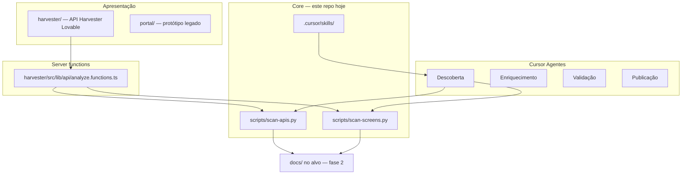

# Arquitetura — Pacote API e Sniffer

**Fase:** construção do produto (sem scan de apps externos).  
**Próximo:** integrar **backend** e **frontend** vindos do Lovable neste monorepo.

---

## Visão em camadas



| Camada | Pasta | Responsabilidade |
|--------|-------|------------------|
| **Core** | `scripts/`, `.cursor/skills/` | Scanners Python, regras, inventário JSON/HTML |
| **Harvester** | `harvester/` *(Lovable)* | UI + `analyzeApis` (URLs, Firecrawl, LLM, export MD/JSON) |
| **Portal** | `portal/` | Protótipo estático legado |
| **Core Python** | `scripts/` | Scan de código local (fase 2) |
| **Ops** | `.github/workflows/`, `*.cmd`, `*.ps1` | CI, validação local, release ZIP |

---

## Pipeline sólido (construção → produção)

### Estágio 1 — Hoje (só pacote)

```text
git push
  → CI: py_compile (scan-apis + scan-screens)
  → CI: smoke --root . (apenas este repo)
  → (manual) VALIDAR.cmd + portal local
```

**Proibido no CI da fase 1:** `--root` apontando para repos/apps externos.

### Estágio 2 — Com backend Lovable

```text
PR / push
  → lint Python (core)
  → test backend (unit)
  → smoke core (--root .)
  → build backend
  → artefato: CLI ou worker que chama scan-apis.py
```

### Estágio 3 — Com frontend Lovable

```text
  → lint + test frontend
  → build frontend (static ou SSR)
  → deploy portal/API no domínio configurado
  → E2E opcional: formulário Search API → job mock
```

### Estágio 4 — Coleta real (quando você autorizar)

```text
Usuário informa URL ou path
  → backend valida + enfileira
  → worker: clone (se GitHub) ou path montado
  → scan-apis + scan-screens
  → grava docs/ + api-catalog + ui-catalog
  → agentes Cursor enriquecem (fora do pipeline CI)
```

---

## Contratos entre peças

### Core → Backend (futuro)

| Endpoint / job | Entrada | Saída |
|----------------|---------|--------|
| `run-api-scan` | `{ root: path }` | `api-inventory.json`, `api-catalog/` |
| `run-ui-scan` | `{ root: path }` | `ui-inventory.json`, `ui-catalog/` |

Invocação direta hoje:

```bash
python scripts/scan-apis.py --root <path> --out <out>/docs
python scripts/scan-screens.py --root <path> --out <out>/docs
```

### Frontend → Backend (futuro)

| Ação UI | API sugerida |
|---------|----------------|
| Search API | `POST /v1/jobs` body `{ target: url \| path \| github }` |
| Status | `GET /v1/jobs/:id` |
| Download ZIP pacote | link estático ou `GET /v1/releases/latest` |
| Ver catálogo | `GET /v1/jobs/:id/artifacts` |

### Agentes Cursor

- Leem skills em `.cursor/skills/`
- **Fase construção:** editam só `backend/`, `frontend/`, `portal/`, `scripts/`, `docs/`
- **Fase coleta:** operam no workspace do app alvo (outro repo)

---

## Estrutura de pastas (alvo)

```text
Pacote-API-e-Sniffer/
├── harvester/            ← API Harvester (Lovable, TanStack Start)
├── backend/ frontend/    ← redirecionam para harvester/
├── portal/               ← protótipo legado
├── scripts/              ← scanners (core estável)
├── .cursor/skills/
├── docs/
│   ├── ARQUITETURA.md    ← este arquivo
│   └── example-run/      ← smoke local (gitignore)
├── .github/workflows/
├── CONSTRUINDO-PACOTE.md
└── GUIA-*.md
```

---

## Integração Lovable (quando trouxer o código)

1. Colar ou copiar projeto para `backend/` e `frontend/`.
2. Documentar em `backend/README.md` e `frontend/README.md` como rodar (`npm run dev`, env).
3. Apontar backend para executar `scripts/scan-apis.py` via `subprocess` (path absoluto ao core).
4. Unificar UX: campo Search API do Lovable substitui `portal/index.html`.
5. Atualizar CI com jobs `backend` e `frontend`.
6. **Não** commitar `.env`, tokens, nem código de apps clientes de teste.

Checklist detalhado: [LOVABLE-INTEGRACAO.md](../LOVABLE-INTEGRACAO.md).

---

## Princípios

1. **Core desacoplado** — scanners funcionam sem backend (CLI/`ESCANEAR.cmd`).
2. **Um repo, um produto** — Pacote Sniffer; apps analisados ficam fora.
3. **Pipeline falha cedo** — compile + smoke no próprio repo em todo push.
4. **Coleta externa é opt-in** — só após fase construção e contrato API estável.

---

## Referências

- [CONSTRUINDO-PACOTE.md](../CONSTRUINDO-PACOTE.md)
- [GUIA-MULTI-AGENTES.md](../GUIA-MULTI-AGENTES.md)
- [CHANGELOG.md](../CHANGELOG.md)
